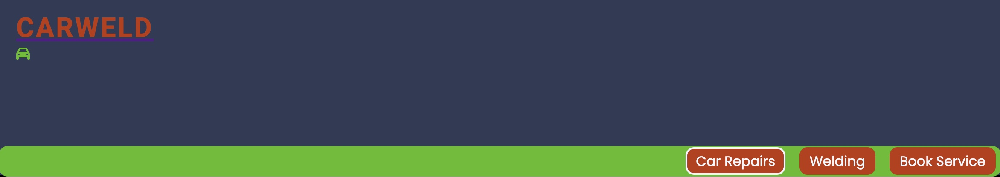
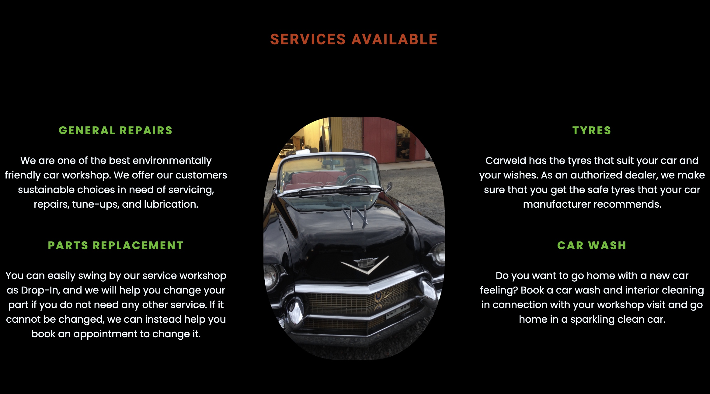
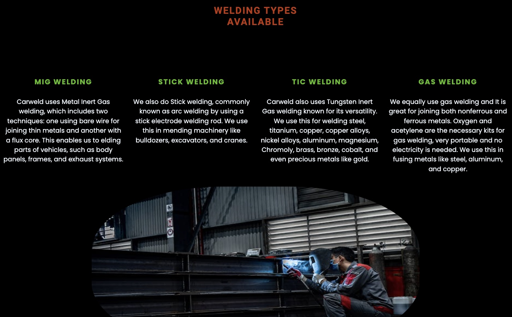
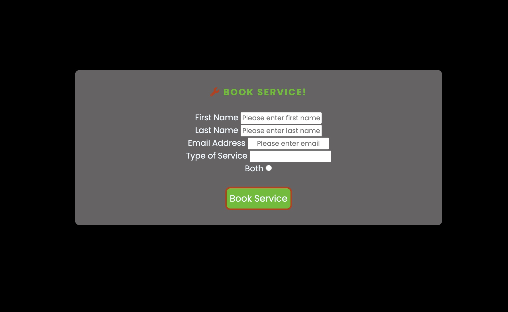
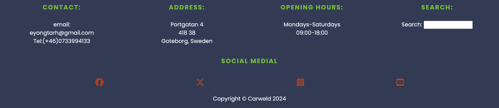
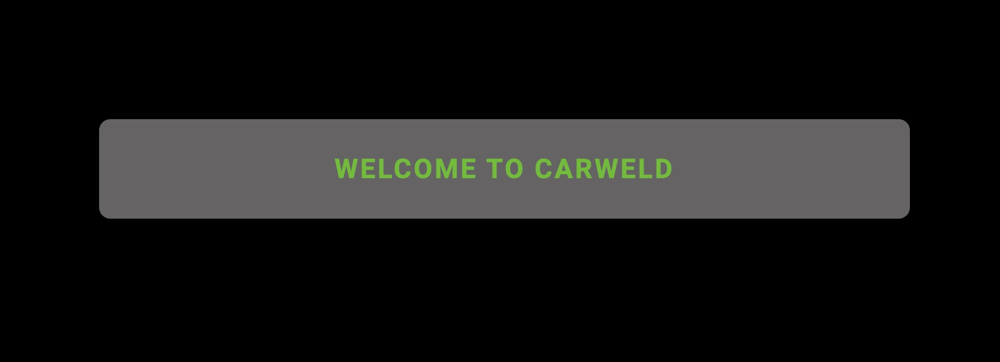

# CARWELD

[Link to Carweld](https://eyongtarh.github.io/Carweld/)

Carweld is a car maintainance and welding service provider. It seeks to make easy 
access to services when need be in the areas of car repaires and welding.

## Features

### Header

The header includes the name : CARWELD, and a car logo. Both have a link to home page. It also includes a 
navigation bar. The navigation bar accommodates the links to the three pages: car repairs, welding, and a 
booking page for services. The header can be seen below:

### Car repairs Page

Here, there are four different services availbe. Firstly, general repairs: a note explainin the types 
of services offered here is introduced. It also highlights the importance of the environment in relation 
to the services offered. Other services here icludes tryes, part replacement and car wash. Lastly, a 
vintage car picture sits in it. See image below:

### Welding Page

The welding section is in the second page and includes a statement that indicates
Carweld is providing four types of welding services. Also , it emphasis the flow
of a sustainable means to achieve its services. Below is an image of Welding page:

### Booking Services page

This is the third and final page. It provides form to fill which includes first name, 
last name, and email. It also contains a datalist which indicates if someone 
is in need of car repairs services or welding services. It also contains a checkbox for 
those who are in need of both services. See photo below:

### The footer

The footer is diveded into two parts: contact information and Social media as shown in the image below:

#### Contact information

The first part of the footer contains the contact information, address, opening hours and search bar. 

#### Socia Media

The footer contains three different features. The first is the opening hours of
Carweld. The second feature are links to social media websites which opens in a 
new page: Twitter, YouTube, Instagram, and Facebook. And lastly, a copyrights
statement.

## Testing

### Within Page

The links included in the page works perfectly.The book service form also shows a positive respond to use. The form submission page is shown below:

### Lighthouse

The accessibility rating for page one in lighthouse is OK. The lighthouse test for the Car repairs page is shown below :

The accessibility rating for page two in lighthouse is OK. The lighthouse test for the Welding page is shown below :

The accessibility rating for page 3 in lighthouse is OK. The lighthouse test for the book service page is shown below :

### Media Queries 

The site works on different screen sizes and therefore, it is fully responsive. The Responsive viewer was used to test for site responsiveness. A photo of page 1, page 2 and page 3 are shown below repectively.

Check out <a href="https://responsiveviewer.org/" target="_blank">Site Responsiveness</a> by Responsive viewer.

Check out <a href="https://ui.dev/amiresponsive?url=https://eyongtarh.github.io/Eyongtarh-Tennis-Club/" target="_blank">Site Responsiveness</a> by ui.dev/amiresponsive.

### Validation Testing

-The HTML validator for the three pages returned no errors when passing through the official W3C validator. 

Page one:

Page Two:

Page Three:

-The CSS validator shows no errors when passing through the official (Jigsaw) validator.

### Bugs

#### Unfixed Bugs

I have not noticed any unfixed bug at the moment.

#### Fixed Bugs

- The Menu bar was at the edge of the right.
  * Solution: I added two spacing tags to move it from the edge.

- The form section width was extensive in laptops and desktop screen sizes. 
  * Solution: This was resolved by setting reducing the width percentage for larger screen sizes.

- The header overlaped the nav section.
  * Solution: The remedy was to add margin-top to nav section to push it down to the base of header.

## Technologies Used
- HTML is used as the framework of the site
- CSS is applied for the styles and site layout
- Gitpod is used for writing the and editing the codes.
- Git and Github used for version control and hosting website codes respectively.
- W3C validator was used to validate the html and css codes.
- Responsive Viewer was used to analise the website responsiveness.

## Deployment to GitHub Pages

This site is deployed to GitHub pages. Theprocedure is viz:
- Go to GitHub repository and click on Settings.
- At the left side, click on pages.
- At the source section drop-down menu, select the Main Branch
- At this point, click save, the page will be automatically refreshed.
- A link will be available and indicate the successful deployment.
- If not , refresh the page.

## Future improvements
- More content can be added.
- There is also a need to make appropriate comments within my code lines and commit statement.
- The form can be made to validate to a server in the long run.

## Credits

I got some help from the Love running project, course content, Wikipedia , hot air tools.

### Content 

I used font awesome and Google fonts.  

### Media
 - Background images, Favicon image, and images used within pages are from: [Pexels](https://www.pexels.com/).
 - I also used personal images and video.

#### Tools
 - [FAVICON GENERATOR](https://favicon.io/) was used to generate the favicon.
 - [bytes](https://ui.dev/amiresponsive?url=https://eyongtarh.github.io/Eyongtarh-Tennis-Club/" ) was used to test website 
   responsiveness.

## Acknowledgments

- [Code Institute](https://codeinstitute.net/) tutors and Mentor for their continues support.
- [Hot Air Tools](https://www.hotairtools.com/) content for welding page.

